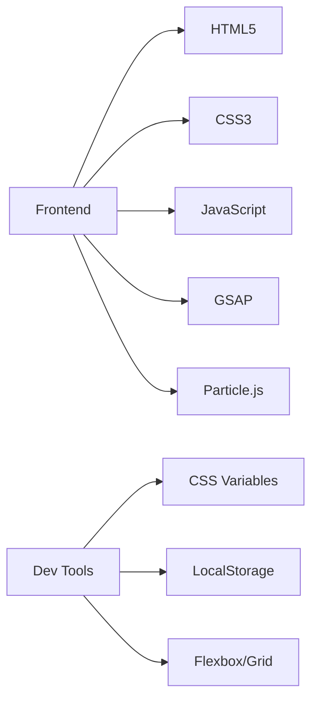

# 🚀 Abdallh Nasser - Creative Developer Portfolio

<div align="center">
  
</div>

## 🌟 Overview
This portfolio showcases **Abdallh Nasser Ahmed Mansour**, a creative frontend developer and UI/UX designer. The site features modern design with interactive animations, glass morphism effects, and a responsive layout.

<div align="center">
  <a href="#live-demo">Live Demo</a> • 
  <a href="#features">Features</a> • 
  <a href="#technologies">Technologies</a> • 
  <a href="#structure">Structure</a>
</div>

---

## ✨ Key Features

| Feature Category | Description |
|------------------|-------------|
| 🎨 **Design Elements** | Gradient backgrounds, glass morphism effects, custom cursor |
| ⚡ **Interactivity** | Theme switcher, animated skill bars, floating icons |
| 📱 **Responsiveness** | Mobile-first approach, hamburger menu for mobile |
| ✨ **Special Effects** | GSAP animations, particle background, ripple click effect |

---

## 🛠 Technologies Used



---

## 📂 Project Structure

```plaintext
index.html
├── Preloader Section
├── Header
├── Hero Section
├── About Section
│   ├── Profile Image
│   ├── Floating Icons
│   └── Skills
├── Projects Section
│   └── Project Cards
├── Contact Section
│   ├── Contact Info
│   ├── Social Links
│   └── Contact Form
└── Footer
```

---

## 🎨 Customization Guide

### Personal Information
```html
<!-- Hero Section -->
<h1>Creating <span class="highlight">Digital Experiences</span> That Inspire</h1>
<p>I'm a passionate frontend developer specializing in...</p>

<!-- About Section -->
<h3>Frontend Developer & UI/UX Designer</h3>
<p>With over 5 years of experience...</p>

<!-- Contact Info -->
<span>abdallhnasser2025@gmail.com</span>
<span>Egypt, Alexandria, Moharm Bek</span>
```

### Projects
```html
<div class="project-card">
  <div class="project-image">
    <!-- Your project image -->
  </div>
  <h3>Project Title</h3>
  <p>Project description</p>
  <div class="project-tags">
    <span class="project-tag">Technology</span>
  </div>
  <div class="project-actions">
    <a href="#" class="btn btn-primary">Live Demo</a>
    <a href="#" class="btn btn-outline">Details</a>
  </div>
</div>
```

### Skills
```html
<div class="skill">
  <div class="skill-info">
    <span class="skill-name">Skill Name</span>
    <span>95%</span>
  </div>
  <div class="skill-bar">
    <div class="skill-progress" data-width="95"></div>
  </div>
</div>
```

---

## 🌐 Live Demo
[View Live Portfolio](https://abdallh-portfolio.netlify.app)

<div align="center">
  <a href="#top">Back to top ↑</a>
</div>

```css
/* Color Variables */
:root {
  --primary-blue: #4361ee;
  --primary-pink: #ff0a78;
  --dark-bg-1: #0f0c29;
  --dark-bg-2: #24243e;
  --text-light: #ffffff;
}
```

```javascript
// Theme Switching
themeToggle.addEventListener('click', () => {
  document.body.classList.toggle('light-mode');
  // Update icon and save preference
});
```

---

<div align="center">
  <h3>🌟 Show your support by starring this repository!</h3>
  <p>© 2025 Abdallh Nasser Ahmed Mansour - All rights reserved</p>
</div>